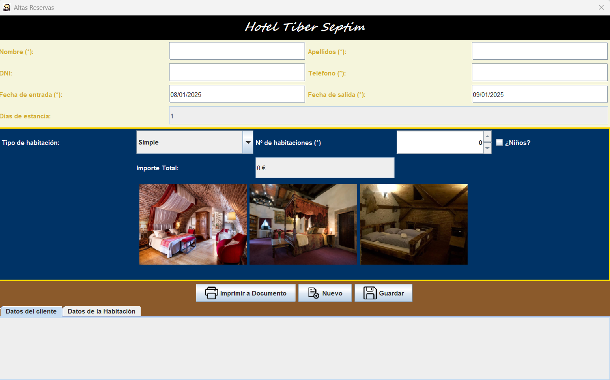

# Swing_P02_compendio | DEINT

### 📋 Descripción del proyecto 📋
El proyecto consiste en una aplicacición de hotel donde puedes reservar una o varias habitaciones en el hotel "Tiber Septim", esta aplicación se ha realizado haciendo uso de Java Swing.

### 📁 Contenido de la publicación 📁
Este repositorio cuenta con cuatro directorios:
* Desarrollo: En este directorio se encuentra el proyecto completo.
* Documentación Técnica: JavaDoc del proyecto.
* Documentación: Documentación de la usabilidad del proyecto.
* Ejecutable: Ejecutable de la aplicación del hotel.

### ⚙️ Desarrollo del proyecto ⚙️
Este proyecto se ha realizado en **Eclipse IDE** y se ha hecho uso de **Java Swing**.

### 📦 Despliegue (como ejecutar la aplicación desde el ejecutable) 📦
1. Windows: Para ejecutar un ejecutable en Windows, es tan facil como hacer doble click en el ejecutable (el archivo con extensión .jar).

2. Linea de comandos: Para ello, deberemos acceder a cmd, a la ruta del ejecutable, escribir el nombre del ejecutable junto a su extensión y darle a "Enter" para ejecutar el ejecutable.
```cmd
:: Ejecución de ejemplo en linea de comando (cmd)
swing_c_p02_GarcíaTorrecillasVictoriano.jar
```

🛠️ Construido con 🛠️
* <a target="_blank" rel="noopener noreferrer nofollow" href="https://camo.githubusercontent.com/bea90da226e09b503e6c8fde824f4816b98dcf30cd31e803006bf6335af06890/68747470733a2f2f696d672e736869656c64732e696f2f62616467652f6a6176612d2532334544384230302e7376673f7374796c653d666f722d7468652d6261646765266c6f676f3d6f70656e6a646b266c6f676f436f6c6f723d7768697465"></a>

### 💡 Versionado 💡
Esta es la primera y última versión del proyecto.

### ✒️ Autores ✒️
* <a href="https://github.com/ViGaTo">ViGaTo</a>

### 📄 Licencia 📄
Este proyecto está bajo licencia gratuita.

### 🌐 Recursos adicionales 🌐
Página Principal: <a href="https://github.com/ViGaTo">https://github.com/ViGaTo</a>

